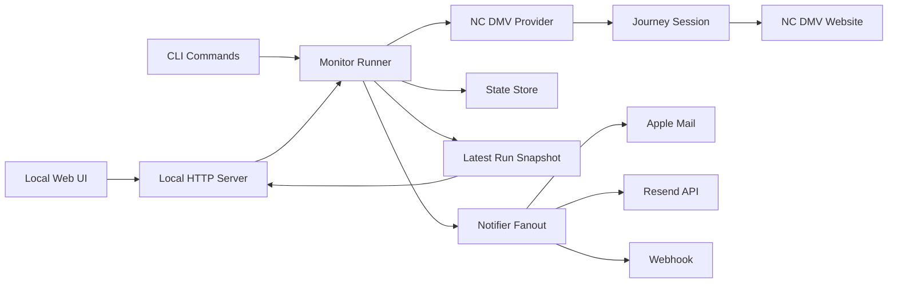

# NC DMV Appointment Monitor

This project monitors the North Carolina DMV appointment site, extracts live openings, filters them against your preferences, shows them in a local web UI, and can notify you when new qualifying availability appears.

It is built around the real NC DMV scheduler flow at:

- `https://skiptheline.ncdot.gov/Webapp/Appointment/Index/a7ade79b-996d-4971-8766-97feb75254de`

The code does not rely on a public DMV API. It navigates the same multi-step appointment flow the website uses.

## What This Project Does

- Opens the live NC DMV appointment journey.
- Selects an exact DMV service such as `Driver License Renewal`.
- Submits location inputs using latitude/longitude and ZIP fallback where supported.
- Finds offices with live availability.
- Loads office-specific dates and then concrete time slots.
- Filters slots by radius, date window, weekday, time window, and excluded offices.
- Stores the latest run so the UI and background poller stay in sync.
- Supports multiple notification channels.
- Applies a separate email-only alert rule for back-to-back nearby openings.

## Current Product Shape

This is not a hosted website. It is a local app made of:

- a scraper/provider for the NC DMV website
- a polling runner
- a local web UI served on `http://localhost:3001`
- optional background polling on macOS via `launchd`

## Architecture



## Repository Layout

- `src/index.mjs`
  Entry point for CLI commands and the local web server.

- `src/server.mjs`
  Local HTTP server for the UI and UI APIs.

- `src/providers/nc-dmv.mjs`
  Site-specific NC DMV scraping logic.

- `src/providers/journey-session.mjs`
  Stateful session layer that keeps cookies, form values, and amend-step state aligned with the DMV flow.

- `src/core/config.mjs`
  Config loading, normalization, and defaults.

- `src/core/matcher.mjs`
  Slot filtering by user preferences.

- `src/core/runner.mjs`
  Polling loop, result generation, dedupe, and notification orchestration.

- `src/core/notifiers.mjs`
  Console, Apple Mail, Resend, webhook, and test-email support.

- `src/core/store.mjs`
  Persistent notification state for slot alerts and email-sequence alerts.

- `src/core/run-state.mjs`
  Shared latest-run snapshot used by both the UI and the background poller.

- `src/background/launch-agent.mjs`
  macOS background poller management.

- `src/web/`
  Static browser UI assets.

- `config.json`
  Your active local config.

- `config.example.json`
  Example config to copy from.

- `data/state.json`
  Persistent dedupe state.

- `data/latest-run.json`
  Latest run snapshot used by the UI.

- `logs/launchd.out.log`
  Background poller stdout log.

- `logs/launchd.err.log`
  Background poller stderr log.

## How The Scraper Works

The NC DMV flow is stateful. The project handles it in stages:

1. Start the appointment journey page.
2. Submit the initial form to reach service selection.
3. Parse the service list from DMV-rendered HTML.
4. Select the exact service.
5. Send location fields into the location step.
6. Parse nearby offices and identify offices currently marked active by the DMV page.
7. For each active office:
   - start a fresh office-specific journey
   - select the same service again
   - select the office
   - parse available dates
   - amend the date control to load available time options
   - build normalized slot objects

This is why the scraper is more reliable than a one-pass HTML scrape, but also why it is sensitive to DMV UI changes.

## Slot Model

Each normalized slot contains:

- provider
- service name
- office name
- office address
- distance in miles when the DMV site exposes it
- UTC start timestamp
- localized display time
- booking URL
- DMV metadata such as office ID and service ID

## Notification Model

There are two notification paths.

### 1. Standard slot notifications

These are based on the watcher filters in `watchers[0]`.

- The runner computes all matching slots.
- A slot is considered `fresh` when it is currently open and was not already open in the immediately relevant prior state.
- If the slot disappears and later reappears, it can be considered fresh again.
- Console and webhook notifications run on this path.
- The UI `new` badges and browser alerts also reflect this path.

### 2. Special email policy

This is intentionally separate from the standard slot list.

The email rule is:

- only send email when there are at least `2` consecutive openings
- the openings must be exactly `15` minutes apart
- they must be at the same office
- they must fall within `25` miles
- they must still satisfy the service/date/time/excluded-office watcher filters

This policy lives under:

- `alertPolicies.emailConsecutiveSlots`

It does not change which slots the UI shows. It only changes when email is sent.

## Requirements

- Node.js `>= 24`
- macOS if you want:
  - Apple Mail notifications
  - background polling via `launchd`

Optional:

- Apple Mail configured with a working outgoing account
- Resend credentials if you want API-based email instead of Apple Mail
- a webhook endpoint if you want external automation

## Quick Start

```bash
cd /Users/adityaaggarwal/Desktop/Duke/Claude/DMV
npm start
```

Then open:

- `http://localhost:3001`

Recommended first-run flow:

1. Choose the exact DMV service.
2. Set your location.
3. Set your radius, date window, and time window.
4. Save settings.
5. Click `Check Now`.
6. If using Apple Mail, click `Send Test Email`.

## CLI Commands

### Start the local UI

```bash
npm start
```

Equivalent:

```bash
node src/index.mjs web
```

### Run one polling cycle

```bash
node src/index.mjs once --config config.json
```

Use this when you want one JSON snapshot of current results.

### Run the poller forever

```bash
node src/index.mjs run --config config.json
```

### Inspect the raw DMV journey

```bash
node src/index.mjs debug:journey --config config.json
```

This is useful when the DMV site changes and the scraper needs debugging.

### Send a test email

```bash
node src/index.mjs test:email --config config.json
```

This triggers the currently enabled email notifier without waiting for DMV inventory changes.

### Run tests

```bash
npm test
```

## Web UI

The UI provides:

- exact DMV service selection from live DMV options
- radius, ZIP, latitude, and longitude inputs
- date and time filtering
- weekday filtering
- excluded office filtering
- result sorting and search
- one-shot checks
- session polling
- background poller management
- reset of seen notification state
- test email trigger

Important behavior:

- `Save Settings` updates `config.json`
- `Check Now` runs a new scrape and refreshes the result set
- the result card reflects the last completed run, not unsaved form edits

If you change radius or service:

1. save
2. run again

## Background Polling On macOS

The app supports a persistent background poller using a `launchd` LaunchAgent.

From the UI:

- click `Enable Background Poller`

From the terminal:

```bash
npm run service:install
```

This creates a LaunchAgent that runs:

```bash
node src/index.mjs run --config config.json
```

It starts at login and is kept alive by `launchd`.

To remove it:

```bash
npm run service:uninstall
```

To manually restart the agent:

```bash
launchctl kickstart -k gui/$(id -u)/com.nc-dmv-appointment-monitor
```

To inspect its status:

```bash
launchctl print gui/$(id -u)/com.nc-dmv-appointment-monitor
```

To watch logs:

```bash
tail -f /Users/adityaaggarwal/Desktop/Duke/Claude/DMV/logs/launchd.out.log
tail -f /Users/adityaaggarwal/Desktop/Duke/Claude/DMV/logs/launchd.err.log
```

## Configuration Reference

The active config file is:

- `config.json`

### Top-level shape

```json
{
  "pollIntervalMs": 180000,
  "provider": {},
  "alertPolicies": {},
  "notifiers": {},
  "watchers": []
}
```

### `pollIntervalMs`

- polling interval in milliseconds
- example: `180000` = every 3 minutes

### `provider`

Supported today:

```json
{
  "type": "nc-dmv",
  "baseUrl": "https://skiptheline.ncdot.gov",
  "journeyPath": "/Webapp/Appointment/Index/a7ade79b-996d-4971-8766-97feb75254de"
}
```

### `watchers`

The app is structured as a watcher system even though the UI currently behaves like a single-watcher tool.

Watcher fields:

- `id`
  Stable watcher identifier used in state storage.

- `active`
  Enables or disables the watcher.

- `email`
  Destination for email-style notifiers. In this repo it defaults to `aditya.aggarwal5598@gmail.com`.

- `serviceName`
  Exact DMV service label. This is the preferred way to select a service.

- `serviceKeywords`
  Legacy fuzzy matching support. The UI no longer depends on it, but the provider still supports it.

- `officePreferences.exclude`
  Array of office-name or address fragments to suppress.

- `officePreferences.anchorZip`
  ZIP fallback used when the DMV page supports ZIP-based distance sorting.

- `officePreferences.radiusMiles`
  Radius used for standard slot matching and UI filtering.

- `officePreferences.latitude`
- `officePreferences.longitude`
  Coordinates used for the DMV site’s nearby-office behavior.

- `datePreferences.from`
- `datePreferences.to`
  Inclusive ISO date boundaries.

- `datePreferences.daysOfWeek`
  Array of `1..7` for Monday through Sunday.

- `timePreferences.start`
- `timePreferences.end`
  Local NC time window in `HH:MM`.

### `alertPolicies.emailConsecutiveSlots`

This is the dedicated email rule for the main use case.

Fields:

- `enabled`
  Enables the special email policy.

- `radiusMiles`
  Fixed radius for the email rule. This is separate from the general watcher radius.

- `gapMinutes`
  Required gap between consecutive slots.

- `minConsecutiveSlots`
  Minimum run length before sending email.

Example:

```json
{
  "alertPolicies": {
    "emailConsecutiveSlots": {
      "enabled": true,
      "radiusMiles": 25,
      "gapMinutes": 15,
      "minConsecutiveSlots": 2
    }
  }
}
```

### `notifiers`

#### Console notifier

```json
{
  "console": {
    "enabled": true
  }
}
```

This prints notification events to stdout.

#### Apple Mail notifier

```json
{
  "appleMail": {
    "enabled": true
  }
}
```

Behavior:

- works only on macOS
- sends through the local Mail app using AppleScript
- requires Mail to be configured with a working outgoing account
- may trigger a macOS Automation permission prompt the first time

#### Resend notifier

```json
{
  "resend": {
    "enabled": false,
    "apiKeyEnv": "RESEND_API_KEY",
    "from": "alerts@example.com"
  }
}
```

Requirements:

- `RESEND_API_KEY`
- verified sender domain or sender address

#### Webhook notifier

```json
{
  "webhook": {
    "enabled": false,
    "urlEnv": "APPOINTMENT_WEBHOOK_URL"
  }
}
```

## Environment Variables

Create `.env` from `.env.example` if you want external notifier credentials.

Supported variables:

- `RESEND_API_KEY`
- `APPOINTMENT_WEBHOOK_URL`
- `PORT`

`PORT` changes the UI port from the default `3001`.

## Data Files

### `data/state.json`

Contains persistent notification state.

It tracks:

- open slot notification state
- email-sequence alert state

This allows the app to avoid sending the same alert every poll while still notifying again if a slot or qualified sequence disappears and later reappears.

### `data/latest-run.json`

Contains:

- `latestResults`
- `latestRunAt`

The UI reads this so it can reflect work performed by the background poller.

## UI/API Surface

The local server exposes these main API routes:

- `GET /api/config`
- `PUT /api/config`
- `GET /api/status`
- `GET /api/service-options`
- `POST /api/run-once`
- `POST /api/polling/start`
- `POST /api/polling/stop`
- `POST /api/background/enable`
- `POST /api/background/disable`
- `POST /api/seen/reset`
- `POST /api/test-email`

## Result Semantics

In each run result:

- `matchedSlots`
  number of currently open slots that match the watcher filters

- `freshSlots`
  number of matching slots considered newly open relative to current notification state

- `freshSlotIds`
  IDs used by the UI to badge new slots

- `emailQualifiedSequences`
  number of office/date sequences that satisfy the special email policy

- `freshEmailAlerts`
  number of new qualified sequences that actually triggered email during that run

## Testing

Current tests cover:

- HTML step extraction
- slot matching behavior
- reopened-slot notification behavior
- the special consecutive-slot email policy

Run:

```bash
npm test
```

## Troubleshooting

### I changed the radius in the UI but the app still shows the old value

The displayed results reflect the last completed run. Save first, then run again.

Use:

1. `Save Settings`
2. `Check Now`

### I see openings manually on the DMV site but not in the app

Check these first:

- exact `DMV Service`
- radius
- excluded offices
- date range
- weekday filter
- time range
- current location / coordinates

Also note:

- the DMV site changes quickly
- `nearestOffices` in diagnostics is only a preview of nearby offices, not the full set within your radius

### I am not receiving Apple Mail alerts

Check:

- Apple Mail is configured and can send mail manually
- macOS granted Automation permission for the process controlling Mail
- the message is not stuck in the Mail outbox
- the message is not landing in spam
- the Mail `Sent` folder contains the attempted email

Useful test:

```bash
node src/index.mjs test:email --config config.json
```

If that succeeds in the terminal but the inbox stays empty, the failure is likely outside the app:

- Mail account configuration
- SMTP/account restrictions
- spam filtering

### Browser notifications are unreliable

That is expected. Browser notifications only work while the DMV monitor tab is open and notification permissions remain granted. They are not a substitute for a true outbound notifier.

### The app says zero slots, but there are openings farther away

That usually means the current watcher radius is filtering them out. The diagnostics panel will show:

- nearby office preview
- active offices before filtering
- offices hidden by distance or exclusions

### The background poller is enabled but nothing seems to happen

Check:

```bash
launchctl print gui/$(id -u)/com.nc-dmv-appointment-monitor
tail -f /Users/adityaaggarwal/Desktop/Duke/Claude/DMV/logs/launchd.out.log
tail -f /Users/adityaaggarwal/Desktop/Duke/Claude/DMV/logs/launchd.err.log
```

Also verify:

- your laptop is awake
- you are logged in
- the config saved on disk is the config you expect

## Limitations

- The NC DMV site is not a stable public API and may change its HTML or hidden field structure at any time.
- Distance filtering only works when the DMV response includes a numeric distance.
- Browser notifications require the tab to remain open.
- Apple Mail delivery depends on local Mail configuration and macOS Automation permissions.
- The current UI is single-watcher oriented even though the runtime model supports multiple watchers.

## Current Default Behavior In This Repo

At the time of writing, the repo is configured to:

- use `aditya.aggarwal5598@gmail.com` as the default alert email
- keep the special email policy enabled
- require `2` consecutive slots
- require a `15` minute gap
- require those email-triggering slots to be within `25` miles

## Suggested Operating Workflow

For day-to-day use:

1. Run the UI with `npm start`
2. Confirm service, location, and time filters
3. Click `Send Test Email`
4. Click `Check Now`
5. Enable the background poller if you want automatic checks after login
6. Use the UI mainly for visibility, and treat email as the important alert channel
